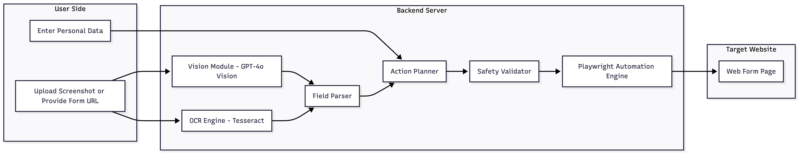
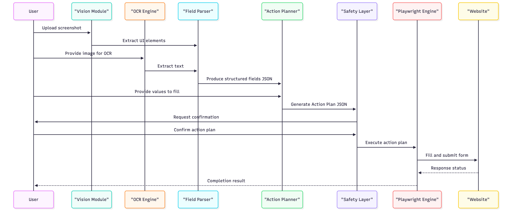

# AI Form Filling Assistant (Vision + UI Automation)

An AI-powered automation tool that interprets web form screenshots using GPT-4o Vision, extracts fields with OCR fallback, generates a JSON action plan, and automatically fills real forms using Playwright.

## 🚀 Features

- 🧠 Vision-based form understanding (text fields, dropdowns, checkboxes)
- 🔎 OCR fallback for accurate text extraction
- 🔧 JSON-based automation plan (type, click, select, scroll)
- 🛡️ Safety layer with confirmation & validation
- 🤖 Playwright-driven UI automation for any website
- 🔁 Supports multi-step forms
- 📸 Works with screenshot OR direct URL

## 🧩 Architecture

### System Architecture Diagram



### 🔁 Automation Workflow



## 📁 Project Structure

```
ai-form-filling-assistant/
│
├── backend/
│   ├── app/
│   ├── automation/
│   ├── services/
│   ├── utils/
│   ├── tests/
│   └── main.py
│
├── docs/
│   ├── architecture.md
│   └── api-spec.md
│
├── frontend/
│   ├── src/
│   │   ├── api/          # API client
│   │   ├── components/   # React components
│   │   └── App.jsx       # Main app
│   └── package.json
│
├── media/
│   ├── architecture-system.png
│   ├── sequence-diagram.png
│
└── README.md
```

## 🏁 Getting Started

### Backend Setup

Install backend dependencies:

```bash
cd backend
pip install -r requirements.txt
playwright install
```

Run server:

```bash
# Option 1: Using python -m (Recommended)
python3 -m uvicorn app.main:app --reload

# Option 2: Using run.py script
python3 run.py
```

The API will be available at `http://localhost:8000`

### Frontend Setup

Install frontend dependencies:

```bash
cd frontend
npm install
```

Set up environment variables (create `.env` file):

```env
VITE_API_URL=http://localhost:8000
```

Run development server:

```bash
npm run dev
```

The frontend will be available at `http://localhost:5173`

### Full Stack

1. Start the backend server (port 8000)
2. Start the frontend dev server (port 5173)
3. Open `http://localhost:5173` in your browser

